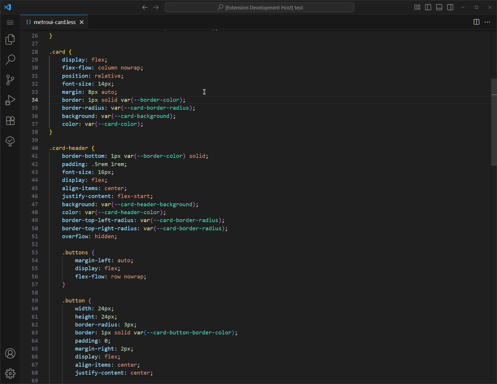

# ⚡ CSS Sorter

An extension that helps you organize your CSS. Also supports SCSS, LESS, and Style in HTML.

## Orders

- ### Alphabetical
  Alphabetical order based on the property's name.

- ### by Importance
  Starts outside the box model, moves inward.
  > See more: [Concentric-CSS](https://github.com/brandon-rhodes/Concentric-CSS)

## Release Notes

Users appreciate release notes as you update your extension.

### 1.0.0
- Major refactor using PostCSS.
- Support for:
    - less
    - scss
    - html

### 0.2.1
- Refactor and bug fixes

### 0.0.1

- Initial release
---

## Contributing

Any contributions or suggestion is welcome. 

**Enjoy!**
